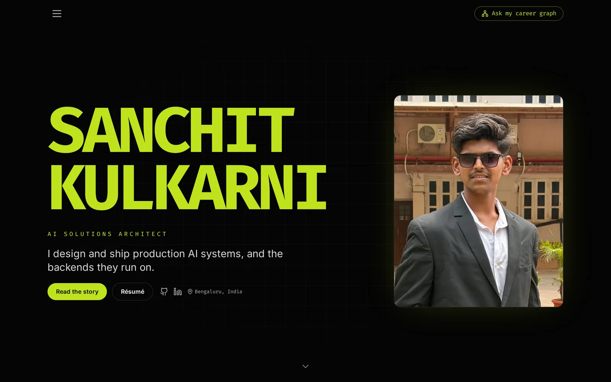
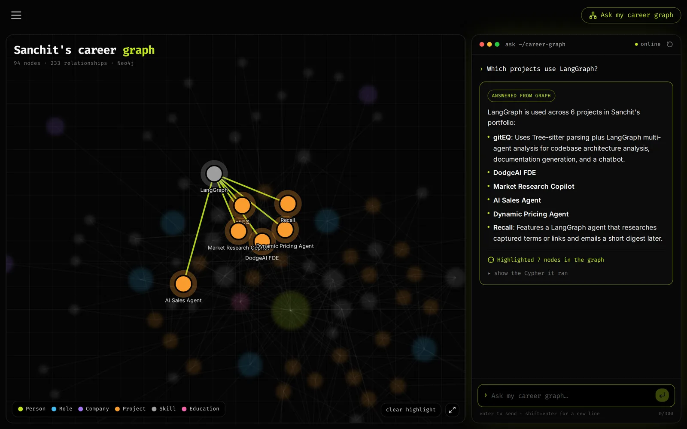
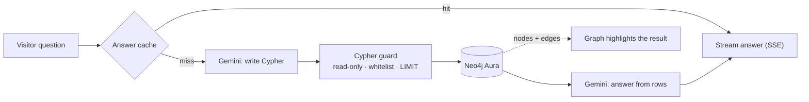

# Sanchit Kulkarni · Portfolio + "Ask my career graph"

**Live:** [sanchitkulkarni.vercel.app](https://sanchitkulkarni.vercel.app) · **Try the chatbot:** [/graph](https://sanchitkulkarni.vercel.app/graph)

My portfolio site, with a GraphRAG chatbot you can ask about my career. Questions are turned into Cypher, run against a live Neo4j knowledge graph of my roles, projects and skills, and answered from the results. The nodes the answer used light up in an interactive graph.





## Highlights

- **Real GraphRAG, not a mock-up.** Gemini writes a Cypher query from the graph schema, the backend runs it on Neo4j Aura, and a second call writes the answer from the rows that came back.
- **Safe by construction.** A Cypher guard rejects anything that isn't a read-only query on known labels and relationships, enforces a `LIMIT`, and runs it in a read transaction with a timeout. `/chat` is rate-limited per IP.
- **Fast.** Answers stream word by word over Server-Sent Events. The suggested questions are answered at startup and pinned in memory, so they return in about 0.4s. Each Gemini attempt has its own deadline, so a stalled call is retried instead of hanging.
- **Explorable graph.** 94 nodes and 233 relationships drawn with d3. Click any node to focus its neighbourhood and blur the rest; chat answers do the same with the nodes they used.
- **Clean backend.** FastAPI with domain / services / infrastructure / api layers and a single composition root. 130 tests, including one that enforces the layering rules.
- **Observable.** Every answer carries a `Server-Timing` header broken down by stage (cache, Cypher generation, database, answer).

## How a question is answered



## Stack

| | |
|---|---|
| Frontend | React · TypeScript · Vite · Tailwind · shadcn/ui · d3-force · Vercel |
| Backend | Python · FastAPI · Neo4j (async driver) · Google Gemini · Render |
| Ops | GitHub Actions keep-warm ping · Vercel Analytics & Speed Insights · EmailJS contact form |

## Repository layout

```
.
├── frontend/   React + Vite + Tailwind site: the story, projects, skills, and the /graph chat page
├── backend/    FastAPI "Career Graph API": text-to-Cypher GraphRAG over Neo4j with Gemini
└── render.yaml Render blueprint for the backend
```

Both halves read the same dataset, `backend/data/career_graph.json`. Change it once and the site and the chatbot stay in sync.

## Run locally

```bash
# Backend (see backend/README.md for details and tests)
cd backend
python -m venv .venv && source .venv/bin/activate
pip install -r requirements-dev.txt
cp .env.example .env                  # NEO4J_* and GOOGLE_API_KEY
uvicorn app.main:create_app --factory --reload --port 8000

# Frontend
cd frontend
npm install
echo "VITE_CAREER_GRAPH_API_URL=http://localhost:8000" > .env.local
npm run dev                           # http://localhost:8080
```

The site works without the backend. The graph renders from the bundled dataset and the chat shows as offline.

## Deploy

| | Frontend (Vercel) | Backend (Render) |
|---|---|---|
| Root directory | `frontend` | `backend` |
| Build | `npm run build` (output `dist`) | `pip install -r requirements.txt` |
| Start | (static) | `uvicorn app.main:create_app --factory --host 0.0.0.0 --port $PORT --proxy-headers --forwarded-allow-ips='*'` |
| Env vars | `VITE_CAREER_GRAPH_API_URL` | `NEO4J_URI`, `NEO4J_USER`, `NEO4J_PASSWORD`, `NEO4J_DATABASE`, `GOOGLE_API_KEY`, `ALLOWED_ORIGINS`, `ALLOWED_ORIGIN_REGEX`, `PYTHON_VERSION=3.11.9` |

On Vercel, keep **"Include files outside the root directory"** enabled: the frontend imports `../backend/data/career_graph.json` at build time.
